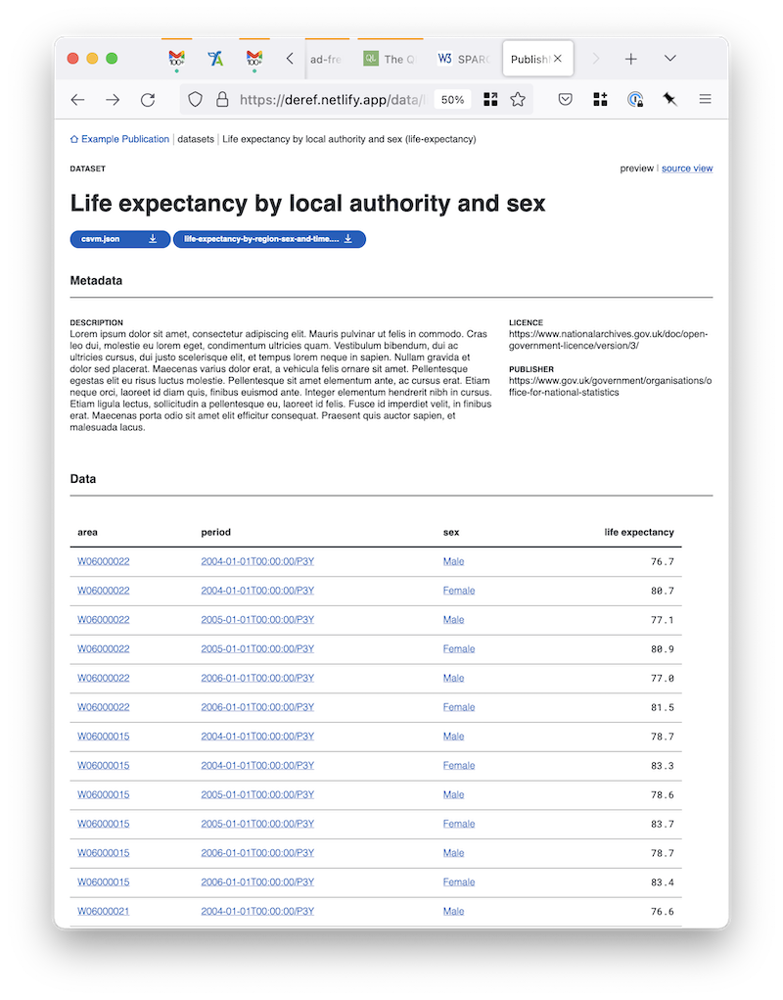
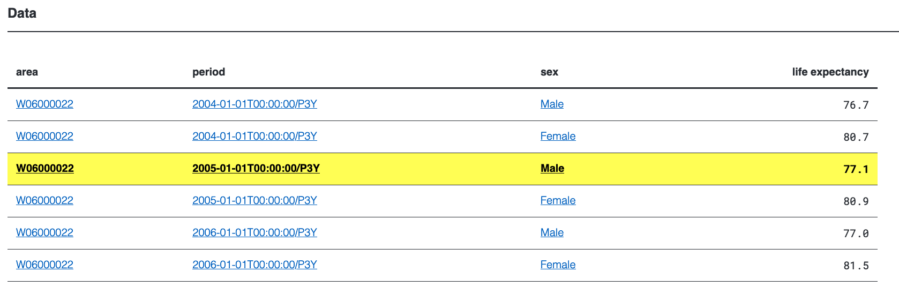
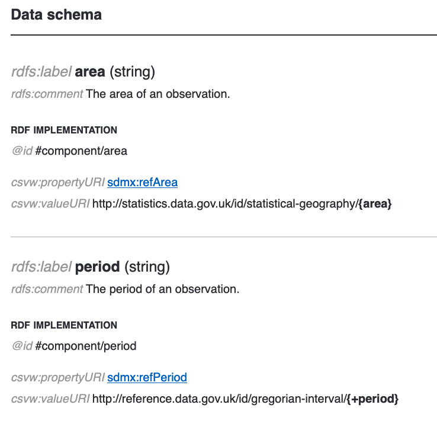

# Aligning Linked Data and the CSVW annotated table

One of CSVW's [stated use
cases](https://www.w3.org/TR/2016/NOTE-csvw-ucr-20160225/#R-AnnotationAndSupplementaryInfo)
was to provide annotations on tabular data, in particular data in the
form of a CSV file.

We believe annotations on tables are an important feature of CSVW
which we want to surface to publishers and users alike. The reasoning
here is that both publishers and consumers are familiar with tables,
so tables and their components (e.g. columns, rows, cells) are a
natural and familiar place to add extra metadata annotations.

The table's structure therefore provides a familiar structure which
users can arbitrarily extend. In practice these extensions mean
annotating various locations within the table (subjects) with pairs of
predicates and objects; and in this way CSVW provides a more familiar
on ramp to the world of linked data.

Similarly we'd like these tables (datasets) to actually be linked
data; that is they should be identified by their locations on the web.
Visiting a "table" would then be dereferencing the table into an
appropriate representation; for example a HTML interface to the
annotated table model, or a `text/csv` representation of the data,
depending on [content negotiation](https://www.w3.org/TR/dwbp/#Conneg).

# What we want to happen

Before we look at the problems, we should first define what outcome we
would like from integrating CSVW with linked data.

Below is a prototype UI for a CSVW interface. It may not be apparent
from looking at it, but this UI demonstrates some interesting
properties that attempt to try and harmonise CSVW and linked data.

Firstly we anticipate that the dataset would be identified by a format
independent `@id`, that is the datasets URI would literally be the
same as the CSV's `@id`, and that visiting it in a browser like below
would return a HTML representation of the data:

Logically for this to occur, the URI of the resource would be
independent of the CSV file itself, and the `@id` would identify the
annotated `csvw:Table`, which would be an abstraction over the CSVW.

The URI `</data/life-expectancy>` would essentially then provide a
uniform interface to the resource and the representation(s) people
want. For example if you ask for `application/csvm+json` you would be
directed to the metadata file, `text/csv` the CSV, whilst `text/html`
or an RDF serialisation such as `application/n-triples` would combine
the two documents to yield the expected representation.

Similarly it would be extremely desirable for all of the URI's to
align appropriately, such that dereferencing an observation by its
`aboutUrl` would return an appropriate representation of it in
context of the table:

The above feels highly intuitive, and brings the combined benefits of
linked data and CSVW to more typical data users. However it's worth
noting that to make this work, we need to unpick some subtle issues in
the specification and clarify our terms of engagement such that this
can occur.

In particular it's worth noting that there are substantial differences
in CSVW between the RDFization of data and the representation of the
source data in the CSV. In CSVW the RDF outputs of `csv2rdf` are not
typically thought to be tabular, but belong to the world of graphs,
rather than tables. However in the cases of CSVW we'd like to present
the derived graph in terms of the table.

This means that in this view `csvw:Column` definitions in the
`csvw:TableSchema` are used as a lens through which we can view the
projected RDF graph. Is a `csvw:Column` the same as an `rdf:Property`?
No, at least not always, but they are in some cases so closely linked
that for practical purposes it is worth treating them as highly
related, and in the case of dataset specific properties they could for
brevity share the same `@id` and be maintained in the same place.

The UI could for example incorporate affordances for accessing
metadata on the columns themselves:

In particular exposing annotations on the `csvw:TableSchema` and
`csvw:Column`s gives us structural locations for publishers and users
to access knowledge in the DSD. For CSVW cubes a tableSchema could
share the same `@id` as the cubes DSD, exploiting this would benefit
maintainance and understanding, and minimise the need to develop whole
new features to handle artificially distinct structures.

I'd like to encourage the view that the same `csvw:TableSchema` is the
most useful lens through which to view the input CSV, the output RDF,
and arbitrary internal stages of processing (such as viewing
validation errors as annotations on what is substantially the same
table). Having publishers and users alike work with the same
[homoiconic representation](https://en.wikipedia.org/wiki/Homoiconicity) is highly
beneficial to understanding, and lets users leverage all
representations simultaneously as extensions within the same model.

In order to do this, and to use the `csvw:TableSchema` as a lens for
viewing the RDF output; there is one small complication, which is that
a csv row may itself yield multiple subjects (`aboutUrl`'s). This can
be solved by `mapcat`/`flatMap`ing over the outputs to remove the
layer of nesting that results. This may in some circumstances result
in one input row becoming several output rows, and may increase the
likelyhood that some columns containing null values.

It's also worth noting that typically for statistical data cubes we
would not expect Tidy data (essentially 3rd normal form) to have
multiple subjects, as that would typically imply a level of
denormalisation.
