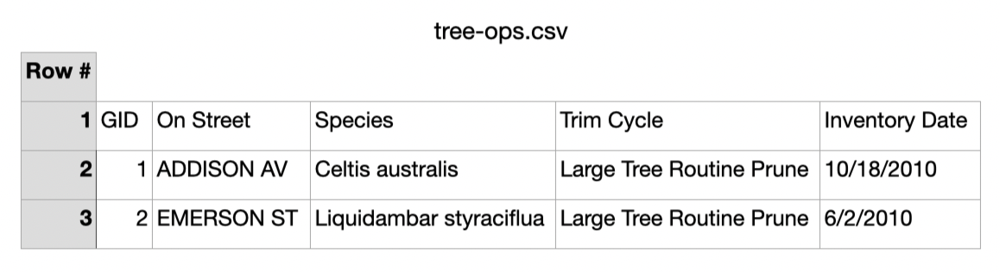
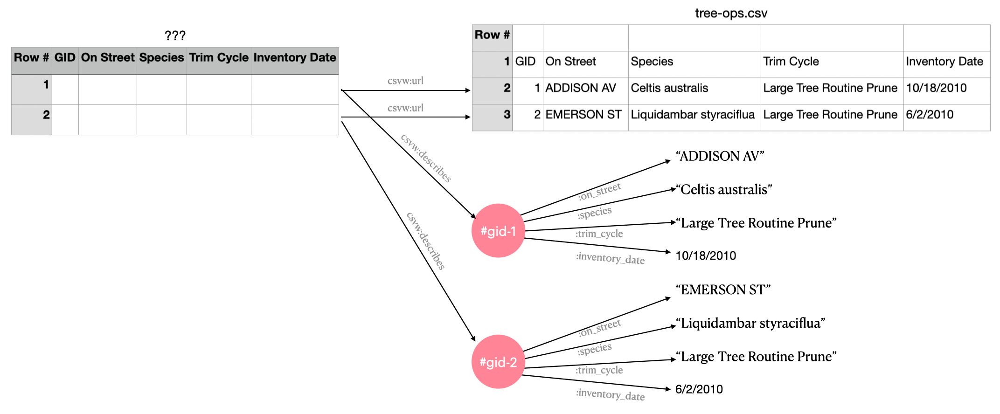

# The CSVW Alignment Problem

Our proposed interfaces aim to use [the annotated table
model](../notes/001-what-is-the-annotated-table-model.md) as the most
complete representation of CSVW, to drive many features and benefits.

However [the vision](../csvw-vision.md) is awkward to achieve due to
problems in CSVW's construction. The main claim here is that the
standardised semantics of CSVW's annnotated table model are subtly
incompatible and create a surprising amount of friction when married
with the requirements for linked data dereferencing.

Due to the issues discussed below, I also claim that CSVW as it stands
yields and encourages unharmonised data outcomes. Outcomes which
result in a proliferation of incomplete and inadequate representations
of "the data", rather than the augmented common representation users
expect.

This issue is related also to [issue #2: CSVW's weird evaluation
semantics](./002-template-evaluation.md).

## A proliferation of representations all different and incomplete

Firstly lets look at some examples from the test suite to help explain
this point. We'll use
[test011](https://github.com/w3c/csvw/tree/gh-pages/tests/test011),
firstly we have the simple CSV file:

```csv
GID,On Street,Species,Trim Cycle,Inventory Date
1,ADDISON AV,Celtis australis,Large Tree Routine Prune,10/18/2010
2,EMERSON ST,Liquidambar styraciflua,Large Tree Routine Prune,6/2/2010
```

This CSV file is our first tabulation and representation of the data.
Users only using this CSV file as the interface get an (optional)
header row of metadata, and zero or more rows of data. In this
interpretation all cells are strings and would require out of band
knowledge on how to parse and interpret them properly.

Assuming users are using a compatible parser, the table will look
something like this:



I've purposefully not distinguished between the column headings and
the data here, as that is knowledge CSVW gives us, which we'd
otherwise have to recieve out of band. Strictly speaking if all we
have is the above file, we can't even assume we know the dialect, and
can't guarantee any tabular parsing at all.

Next we have the JSON-LD metadata document:

```json
{
  "@context": ["http://www.w3.org/ns/csvw", {"@language": "en"}],
  "url": "tree-ops.csv",
  "dc:title": "Tree Operations",
  "dcat:keyword": ["tree", "street", "maintenance"],
  "dc:publisher": {
    "schema:name": "Example Municipality",
    "schema:url": {"@id": "http://example.org"}
  },
  "dc:license": {"@id": "http://opendefinition.org/licenses/cc-by/"},
  "dc:modified": {"@value": "2010-12-31", "@type": "xsd:date"},
  "tableSchema": {
    "columns": [{
      "name": "GID",
      "titles": ["GID", "Generic Identifier"],
      "dc:description": "An identifier for the operation on a tree.",
      "datatype": "string",
      "required": true
    }, {
      "name": "on_street",
      "titles": "On Street",
      "dc:description": "The street that the tree is on.",
      "datatype": "string"
    }, {
      "name": "species",
      "titles": "Species",
      "dc:description": "The species of the tree.",
      "datatype": "string"
    }, {
      "name": "trim_cycle",
      "titles": "Trim Cycle",
      "dc:description": "The operation performed on the tree.",
      "datatype": "string"
    }, {
      "name": "inventory_date",
      "titles": "Inventory Date",
      "dc:description": "The date of the operation that was performed.",
      "datatype": {"base": "date", "format": "M/d/yyyy"}
    }],
    "primaryKey": "GID",
    "aboutUrl": "#gid-{GID}"
  }
}
```

There are several interpretations of this document, which yield
slightly different but largely overlapping results:

1. csv2rdf standard-mode (and minimal-mode)
2. A pure JSON-LD interpretation
3. A bespoke (but CSVW intention honoring) interpretation; reading the
   metadata file and the CSV side by side; to construct an in process
   "annotated table". Such a process might provide a preview UI etc,
   or engage in a bespoke transformation etc.

Under csv2rdf standard-mode the `csv2rdf` algorithm
yields our "second table" of sorts, the "annotated table":

```turtle
    [
      a csvw:Table;
      dc:title "Tree Operations"@en;
      dcat:keyword "tree"@en,
        "street"@en,
        "maintenance"@en;
      dc:license <http://opendefinition.org/licenses/cc-by/>;
      dc:modified "2010-12-31"^^xsd:date;
      dc:publisher [
        schema:name "Example Municipality"@en;
        schema:url <http://example.org>
      ];
      # ... rows ...
      csvw:url <tree-ops.csv>
    ]
```

So here we can see that the annotated table represented by the
outermost delimeters has no `@id`, and is instead identified by a
blank node, represented in the turtle above by the delimiters `[]`.

A blank node semantically should be interpreted as an "existential
variable", i.e. we know something in the world exists, and whilst we
don't know what thing it is we may know some facts about that thing.

This is analagous to a witness of a crime who may tell you some
descriptive characteristics about the perpetrator, but they don't know
who they were.

So without an `@id` we can't identify which table this is; and
logically the annotated table might be different from the CSV file it
is pointing at. Regardless operating under either closed or open world
assumptions, we're forced to treat this as either a different table to
that in the CSV, or as being in a heisenberg like state of
uncertainity where it's potentially the same or different.

Users can always assign an `@id` and set the annotated table's
identifer to be whatever they want. So, one obvious way to align these
representations is to set it to be the same as the CSV file's
location, it's `csvw:url`.

If we do this however we are baking the concrete representation into
our identifier and not allowing for other representations of the
table. For example it would be highly desirable for users pasting a
CSVW backed dataset's URI into a web browser to receive a HTML
interface representation of the dataset when visiting it, and this
pattern prohibits this.

## csvw:Table's aren't really tables!

One might say it is fine for the CSV and the `csvw:Table` to have
different identifiers because a `csvw:Table` *is* really just a
description of the table, whilst the csv file itself *is* the actual
table.

Whilst this distinction between description and table is logical, it
is not particularly helpful for us. The proliferation of identifiers
leads to a proliferation of locations (web resources) and an
artificial separation of concerns which does not benefit users.

Additionally it prohibits many optimisations, for example it is
significantly faster to materialise a HTML representation of a tidy
table of observations if you can take them directly from the CSV file
guided by the metadata document, than it is to atomise them into
triples indexed in a triplestore, and try to reconstitute the input
table from the triples via a SPARQL query.

So the question then becomes, can we align the `csvw:Table`
description with the actual table, such that we can treat them
logically as one and the same thing?

I believe you can do this by hand, but unfortunately not with the
`csv2rdf` specification as it stands.

Lets look at the next problem, and see what `csv2rdf` has done with
[our rows](https://github.com/w3c/csvw/blob/0f3a1fde0b8851692150f1862f56e0eead111560/tests/test011/result.ttl#L21-L48):

```turtle
      csvw:row [
        a csvw:Row;
        csvw:describes :gid-1;
        csvw:rownum 1;
        csvw:url <tree-ops.csv#row=2>
      ],  [
        a csvw:Row;
        csvw:describes :gid-2;
        csvw:rownum 2;
        csvw:url <tree-ops.csv#row=3>
      ];
      csvw:url <tree-ops.csv>
```

The diagram below attempts to show what is occuring here; on the right
we have the concrete CSV table representation, on the left is a
representation of our annotated table. To simplify the model I've not
actually shown the annotated table as triples, but have drawn it as a
table, and have glossed over some details (for example csv2rdf
standard mode won't actually emit the column annotations, for that
you'd need to interpret the document again as JSON-LD).

The identifier of the annotated table at this stage is a blank node,
represented in the diagram as `???`.

The annotated tables row's are all connected to the `csvw:Table` via
the `csvw:row` property.

Finally at the bottom of the diagram we show the desired RDF graph
(represented as blobs and lines). Each `csvw:Row` links to the nodes
it constructed via a `csvw:describes` predicate. The 3 representations
we have are shown here:



## csvw:Row's aren't rows!

This is in my mind one of the biggest conceptual problems with CSVW.
If you look at the diagram above you'll realise that what we thought
were rows in the annotated table aren't really rows in our table at
all. They merely serve to connect:

1. rows in the source CSV to the RDF outputs via both the
`csv:url` with an [RFC7111](https://www.rfc-editor.org/rfc/rfc7111)
csv fragment identifier.
2. the generated RDF output to the source row.

Whilst `csv2rdf` provides ways to access the `_row` and `_source` row
in URI templates, the URI templates are only used to influence the
construction of the output; crucially they're not used to facilitate
description of the input; so there is no way within `csv2rdf` to
assign your own `@id`'s to rows in the annotated table model.

However the [csvw
vocabulary](https://www.w3.org/ns/csvw#class-definitions) does
describe them as a generalisation of what we might think of rows:

> A Row represents a horizontal arrangement of cells within a Table.

We can quibble that this definition is really defining a subset of a
Row, but it is sufficient for our purposes, as subsets contain
themselves.

So the vocabulary and its usage in csv2rdf are somewhat conflated
here. One might say it's ok, a row in `csv2rdf` is a proxy to finding
a row, and the generated resource; but structurally that is quite
different to what the `csvw:Row` represents.

So perhaps we can align the `@id` of each `csvw:row` with an RFC7111
`#row` fragment identifier instead? That way at least dereferencing a
`csvw:Row` would yield a representation of the row. The rows would
conceptually have a tautological `?row csvw:url ?row` triple, but we
could easily ignore that.

Well unfortunately, no you can't do that, `csv2rdf` insists that
`csvw:Row`'s are only blank nodes, and provides no affordances for their
identifying them in any other way.

> 4.6.1: In standard mode only, establish a new blank node R which
> represents the current row.

Yes, in the annotated table, your `csvw:Row`'s can never have global
identifiers, they are always and only ever blank nodes, and if you
can't give them an `@id` you can't annotate them.

You can align `aboutUrl` to `_row` or `_sourceRow` but not the
connective `csvw:row` objects.

## Column annotations are ommitted

Oddly the `csv2rdf` output does not include a representation of the
columns though you can obtain one by additionaly interpreting the
metadata document as JSON-LD. In our diagrams above we assume we have
done this.

These columns are defined and declared within the metadata document.

The RDF output (from the URItemplates etc) is an arbitrary other
representation entirely.

It's worth noting that so far we've been working with just CSVW, but
in practice we also want to describe our statistical data as RDF Data
cubes. If we're not careful these cubes would then be a fourth
representation of the same data.

Ideally we would have one abstract "linked data dataset", which
benefitted from all of the annotations, extensions and representations
we are using. We wouldn't have a CSV file, and an annotated table, and
some RDF output with some provenance linked them, but instead would
have one dataset, which was augmented with unified metadata.

## Representation independence

This might be a curious thing to ask for, given that "CSV on the Web"
has CSV in the title, but ideally we want to be independent of
specific data formats. RDF, linked data and the web architecture
itself were all designed to support arbitrary representations, yet
many parts of CSVW's design encourage representation centricity,
making it hard to avoid.

CSVW's annotated table model and vocabulary is largely representation
independent and is intended to work with HTML tables for example.
However many parts of spec, in particular around URI generation result
in representation centricity.

Similarly the specs always assume that a CSV on the web will be
obtained by a GET request; and the specs do not assume a CSV
representation can be obtained through content negotation on an
abstract resource. For example the specs could have specified that
user agents _SHOULD_ set a header of `Accept: text/csv`.

If you're not careful however CSVW will tie you and your identifiers
to concrete representations, rather than abstract resource
identifiers. This poses a problem when we want to publish a dataset on
the web. We're already invested in linked data, so ideally we want to
publish a dataset with a single identifier, and have dereferencing
that identifier not always give you the CSV, but have it give you an
appropriate representation depending on content negotiation.

## @base URI's are weird and broken

This is discussed in the related issue of [template
evaluation](./002-template-evaluation.md). Ultimately the work around
here is to use absolute URIs everywhere, however that is highly
undesirable, as it reduces the portability of the data, and makes it
hard to untether it from a global context.

In particular it also means that data developers cannot defer
decisions about where data will eventually published to whomever does
the publishing. Instead they must coordinate around URI's and ensuring
their locations are agreed in advance.

## CSVW assumes there's only ever one representation (CSV)

The CSVW standards do not when requesting a CSV file even suggest that
clients _should_ do the sensible thing and set an `Accept: text/csv`
HTTP header. This is problematic for us because we want to support a
model where the same identifier has multiple representations.

We can avoid this problem by sending the `text/csv` representation to
clients that do not set an Accept header.

i.e. we can send `text/csv` as the default representation when there
is no accept header. This shouldn't affect users visiting the content
in their browser as all browsers will send `Accept: text/html` with a
high priority (`q` value).

# A suggested solution

There are a variety of possible solutions here. And I'll not describe
any too deeply here, as there may be other approaches too. Instead
I'll just hint towards a set of changes that I believe would go
together to solving the problems as outlined.

The main goal here is to achieve a single logical table, "the dataset"
and for all the identifiers to work with linked data dereferencing. I
assume some small deviations from the standard are permitted partly
because I can't think of any other solution which meets my stated
requirements.

## Step 1: Coin an abstract annotated table identifer

We want our dataset in all its guises to be format independent and
based in a location we control. We also want to set the base to the
location of "the dataset", so we can coin relative identifiers to
this. Setting `@id` to the empty string should give us an `@id` of
`http://example.org/data/tree-ops` for the dataset, our annotated
table:

```json
{
  "@context": ["http://www.w3.org/ns/csvw", {"@language": "en",
                                             "base": "http://example.org/data/tree-ops"}],
  "@id": "",
  # "url": "tree-ops.csv",
  # ...
}
```

We assume also that we fix the weird base URI for [template evaluation
with solution
1](./002-template-evaluation.md#solution-1-change-the-base-for-resolution-of-templates).
This means that any template URI's are expanded relative to
`http://example.org/data/tree-ops`.

## Step 2: Define a new csv2rdf mode

This mode does the following:

1. Uses the base URI semantics [we want](./002-template-evaluation.md#solution-1-change-the-base-for-resolution-of-templates).
2. Generates [RFC7111](https://www.rfc-editor.org/rfc/rfc7111)
   identifiers for `csvw:Row`'s and does so in terms of the `@id`.
   i.e. http://example.org/data/tree-ops#row-1. These now derefence to
   the metadata document. I think these should probably be offsets
   into the CSV (i.e. `_sourceRow` not `_row`) so not correspond to
   logical rows in the annotated table. This is so clients using only
   the CSV can dereference them properly. In terms of the annotated
   table model these are just used as opaque identifiers; but they are
   now unambiguously refrencable for annotation. NOTE we may probably
   won't RDFize these triples, but the UI can still dereference them
   as if they existed.
3. As implied in 1; `aboutUrl` templates will expand in terms of the
   `base`, and thus can dereference to resources within the table. In
   the tabular HTML interface these may highlight the row(s) which
   yielded that subject. We may also use heuristics (e.g. the presence
   of only one `aboutUrl` would imply tidy data) and allow us to
   assume there are no complex overlapping cases.
4. Emit column annotations such that the annotations exist as RDF.
   This is highly useful as the column annotations are a logical place
   for users to provide cube and other arbitrary annotations.
5. Build the HTML UI such that it works with `aboutUrl`'s that
   dereference into the table itself; so we can use the table as the
   means by which users represent this portion of the graph.

I believe the above changes would resolve the bulk of the issues
discussed, and would hugely assist in not only aligning
representations; but would also help leverage the tabular structure of
the CSV to solve important other problems; most notably performance
issues in tabular processing.

# A second solution

Define an extended subset of CSVW table schemas in JSON-LD that has the 
alignment semantics we want, and use that to generate a CSVW that aligns
the various table representations with our linked data URI's.
