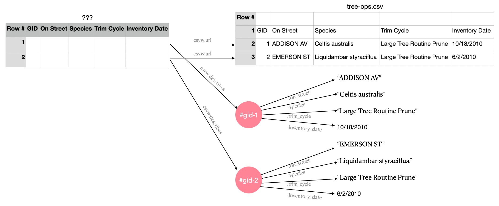

# Shattered dreams: CSVW's annotated table

One of CSVW's [stated use
cases](https://www.w3.org/TR/2016/NOTE-csvw-ucr-20160225/#R-AnnotationAndSupplementaryInfo)
was to provide annotations on tabular data, in particular data in the
form of a CSV file.

CSVW aims to do this by adding a metadata file, which describes a CSV
file, and grants it a dialect, an optional schema, and arbitrary other
annotations in a subset of JSON-LD. The metadata document is a JSON-LD
derived format for annotating the CSV file, within what CSVW calls the
[annotated table
model](https://www.w3.org/TR/2015/REC-tabular-data-model-20151217/#dfn-annotated-table)

My proposition is that the standardised semantics of CSVW's annnotated
table model are largely incompatible with linked data dereferencing.

Due to the issues outlined here, I also claim that CSVW as it stands
yields and encourages unharmonised data outcomes. Outcomes which
result in a proliferation of incomplete and inadequate representations
of "the data", rather than the augmented common representation users
want.

I propose some suggested solutions to these issues below.

This issue is related also to [issue #1: CSVW's weird evaluation
semantics](./001-template-evaluation.md).

## A proliferation of representations all different and incomplete

Firstly lets look at some examples from the test suite to help explain
this point. We'll use [test011](https://github.com/w3c/csvw/tree/gh-pages/tests/test011), firstly we have the simple CSV file:

```csv
GID,On Street,Species,Trim Cycle,Inventory Date
1,ADDISON AV,Celtis australis,Large Tree Routine Prune,10/18/2010
2,EMERSON ST,Liquidambar styraciflua,Large Tree Routine Prune,6/2/2010
```

This CSV file is our first tabulation and representation of the data.
Users only using this CSV file as the interface get an (optional)
header row of metadata, and zero or more rows of data. In this
interpretation all cells are strings and would require out of band
knowledge on how to parse and interpret them properly.

Next we have the JSON-LD metadata document:

```json
{
  "@context": ["http://www.w3.org/ns/csvw", {"@language": "en"}],
  "url": "tree-ops.csv",
  "dc:title": "Tree Operations",
  "dcat:keyword": ["tree", "street", "maintenance"],
  "dc:publisher": {
    "schema:name": "Example Municipality",
    "schema:url": {"@id": "http://example.org"}
  },
  "dc:license": {"@id": "http://opendefinition.org/licenses/cc-by/"},
  "dc:modified": {"@value": "2010-12-31", "@type": "xsd:date"},
  "tableSchema": {
    "columns": [{
      "name": "GID",
      "titles": ["GID", "Generic Identifier"],
      "dc:description": "An identifier for the operation on a tree.",
      "datatype": "string",
      "required": true
    }, {
      "name": "on_street",
      "titles": "On Street",
      "dc:description": "The street that the tree is on.",
      "datatype": "string"
    }, {
      "name": "species",
      "titles": "Species",
      "dc:description": "The species of the tree.",
      "datatype": "string"
    }, {
      "name": "trim_cycle",
      "titles": "Trim Cycle",
      "dc:description": "The operation performed on the tree.",
      "datatype": "string"
    }, {
      "name": "inventory_date",
      "titles": "Inventory Date",
      "dc:description": "The date of the operation that was performed.",
      "datatype": {"base": "date", "format": "M/d/yyyy"}
    }],
    "primaryKey": "GID",
    "aboutUrl": "#gid-{GID}"
  }
}
```

There are several interpretations of this document, which yield
slightly different but largely overlapping results:

1. csv2rdf standard-mode (and minimal-mode)
2. A pure JSON-LD interpretation
3. A bespoke (but CSVW intention honoring) interpretation; reading the
   metadata file and the CSV side by side; to construct an in process
   "annotated table". Such a process might provide a preview UI etc,
   or engage in a bespoke transformation etc.

Under csv2rdf standard-mode the `csv2rdf` algorithm
yields our "second table" of sorts, the "annotated table":


```turtle
    [
      a csvw:Table;
      # ... rows ...
      csvw:url <test010.csv>
    ]
```

So here we can see that the annotated table represented by the
outermost delimeters has no `@id`, and is instead identified by a
blank node, represented in the turtle above by the delimiters `[]`.

A blank node semantically should be interpreted as an "existential
variable", i.e. we know something in the world exists, and whilst we
don't know what thing it is we may know some facts about that thing.

This is analagous to a witness of a crime who may tell you some
descriptive characteristics about the perpetrator, but they don't know
who they were.

So without an `@id` we can't identify which table this is; and
logically the annotated table might be different from the CSV file it
is pointing at. Regardless operating under either closed or open world
assumptions, we're forced to treat this as either a different table to
that in the CSV, or as being in a heisenberg like state of
uncertainity where it's potentially the same or different.

One might say this is fine, the `csvw:Table` *is* really just a
description of the table, whilst the csv file itself *is* the actual
table. This distinction is essentially what you get by default,
however as we'll see it's not really possible within the spec to align
the table description with the representation, and present a unified
model of a table.

Before we try and align the model and representation, lets look at
what `csv2rdf` does with our rows:


```turtle
    [
      a csvw:Table;
      csvw:row [
        a csvw:Row;
        csvw:describes [
          :country "AD";
          :name "Andorra"
        ];
        csvw:rownum 1;
        csvw:url <test010.csv#row=2>
      ],  [
        a csvw:Row;
        csvw:describes [
          :country "AF";
          :name "Afghanistan"
        ];
        csvw:rownum 2;
        csvw:url <test010.csv#row=3>
      ],  [
        a csvw:Row;
        csvw:describes [
          :country "AI";
          :name "Anguilla"
        ];
        csvw:rownum 3;
        csvw:url <test010.csv#row=4>
      ],  [
        a csvw:Row;
        csvw:describes [
          :country "AL";
          :name "Albania"
        ];
        csvw:rownum 4;
        csvw:url <test010.csv#row=5>
      ];
      csvw:url <test010.csv>
    ]
```

The diagram below attempts to show what is occuring here; on the right
we have the concrete CSV table representation, on the left is a
representation of our annotated table. To simplify the model I've not
actually shown it as triples, but have drawn it as a table, and have
glossed over some details (for example csv2rdf standard mode won't
actually emit the column annotations, for that you'd need to interpret
the document again as JSON-LD).

The identifier of the annotated table at this stage is a blank node
(represented here as `???`).

Regardless the annotated table exists in our output as triples, and
the row's are all connected to the `csvw:Table` via the `csvw:row`
property. The astute will notice that our `csvw:Row`'s are all
identified by blank nodes which link to the source row via the
`csvw:url` property and an
[RFC7111](https://www.rfc-editor.org/rfc/rfc7111)
csv fragment identifier.

Finally at the bottom of the diagram we show the desired RDF graph
(represented as blobs and lines). Each `csvw:Row` links to the nodes
it constructed via a `csvw:describes` predicate:



Firstly in the annotated table model, the `csvw:Row`'s don't
actually contain any data.


Unfortunately the specification doesn't include the actual
metadata file which yields this result, however there are some
[similar
examples](https://github.com/w3c/csvw/blob/0f3a1fde0b8851692150f1862f56e0eead111560/tests/test101-metadata.json)
in the CSVW test suite which we can massage into the right shape:

```json
{
  "@context": "http://www.w3.org/ns/csvw",
  "url": "countries.csv",
  "tableSchema": {
      "columns": [{
        "name": "countryCode",
        "titles": "countryCode",
        "datatype": "string",
        "propertyUrl": "http://www.geonames.org/ontology{#_name}"
      }, {
        "name": "latitude",
        "titles": "latitude",
        "datatype": "number"
      }, {
        "name": "longitude",
        "titles": "longitude",
        "datatype": "number"
      }, {
        "name": "name",
        "titles": "name",
        "datatype": "string"
      }],
      "aboutUrl": "{#countryCode}",
      "propertyUrl": "http://schema.org/{_name}"
  }
}
```

When `csv2rdf` is run on a document like the above something like this
will be the output of the transformation:

```turtle
@base <http://example.org/countries.csv> .

<#AD>
  <#countryCode> "AD" ;
  <#latitude> "42.5" ;
  <#longitude> "1.6" ;
  <#name> "Andorra" .

<#AE>
  <#countryCode> "AE" ;
  <#latitude> "23.4" ;
  <#longitude> "53.8" ;
  <#name> "United Arab Emirates" .

<#AF>
  <#countryCode> "AF" ;
  <#latitude> "33.9" ;
  <#longitude> "67.7" ;
  <#name> "Afghanistan" .
```

NOTE that the output of this process is to create new identifers
logically in the CSV document, but that these identifiers are not
themselves the same as the identifiers for the CSV rows. For those we
need to look at the representation of the annotated table model where
we see this emitted (under standard mode):


```turtle
@base <http://example.org/countries.csv> .
@prefix csvw: <http://www.w3.org/ns/csvw#> .
@prefix xsd: <http://www.w3.org/2001/XMLSchema#> .

_:d4f8e548-9601-4e41-aadb-09a8bce32625 a csvw:TableGroup ;
  csvw:table [ a csvw:Table ;
    csvw:url <http://example.org/countries.csv> ;
    csvw:row [ a csvw:Row ;
      csvw:rownum "1"^^xsd:integer ;
      csvw:url <#row=2> ;
      csvw:describes <#AD>
    ], [ a csvw:Row ;
      csvw:rownum "2"^^xsd:integer ;
      csvw:url <#row=3> ;
      csvw:describes <#AE>
    ], [ a csvw:Row ;
      csvw:rownum "3"^^xsd:integer ;
      csvw:url <#row=4> ;
      csvw:describes <#AF>
    ]
  ] .
```


CSVW does however allow you to assign your own `@id` to the logical
table, e.g. we could add the line `@id` to the above json-ld, setting
the `@id` to be the same as the `@base`:

```
{
 "@context": ["http://www.w3.org/ns/csvw", {"@base": "http://example.org/countries"}],
  "@id": ""
  ...
}

```

This is the right starting point for our abstract annotated table. It
would give us something like this:

```
<http://example.org/countries>
    a csvw:Table ;
    csvw:url <http://example.org/countries.csv> ;
    csvw:row [ a csvw:Row ;
      csvw:rownum "1"^^xsd:integer ;
      csvw:url <#row=2> ;
      csvw:describes <#AD>
    ]
```

This literally says there is an "annotated table" at
`<http://www.swirrl.com/csvw/example/countries>` which has a csv `url`
at `countries.csv` and in that csv there exists a `csvw:Row`, though we
don't know which row, which describes the resource found at
`</countries.csv#AD>`.

The data in the `csvw:Row` itself does then give us metadata which
lets us (as humans) work out through deduction that it comes from
`csvw:rownum 1` which can be found at `<#row=2>` in the csv file,
however this information would in many cases naturally want to be part
of the `csvw:Row` identifier and not expressed in such an unhelpful
manner, which necessitates further post processing.

So surely CSVW lets us not only assign an `aboutUrl`, but a `rowUrl`
or an identifier for the row in the annotated table?  Well no, it turns
out if you read the part of the standard it's not possible:

> 4.6.1: In standard mode only, establish a new blank node R which
> represents the current row.

Yes, in the annotated table, your `csvw:Row`'s can never have
identifiers, they are always and only ever blank nodes. The specs do
leverage [RFC7111](https://www.rfc-editor.org/rfc/rfc7111) which was
largely developed to support CSVW.


but as
we'll see later whilst the csvw vocubulary provides a sufficient
description of a table, the `csvw` specifications and in particular
the `csv2rdf` algorithm yield poor results when describing tables.
