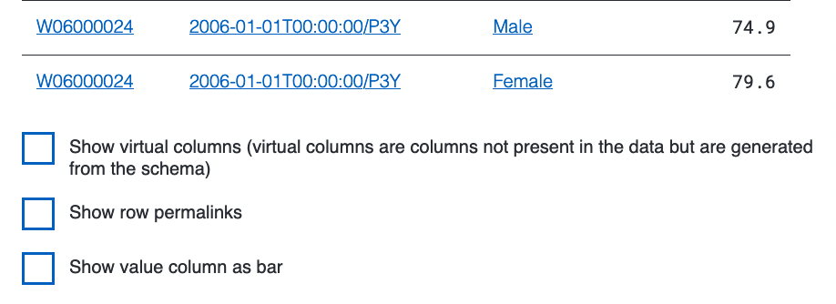

# Confusion over the Annotated Table model

Reading the specs people are often unclear about what exactly the
annotated table is. It is frequently confused or seen as equivalent to
the RDF, however in reality it is something different.

When you closely read the specifications (principally the core
[tabular data
model](https://www.w3.org/TR/2015/REC-tabular-data-model-20151217/)
specification) it is clear that the annotated table is essentially an
[in-process
representation](https://www.w3.org/TR/2015/REC-tabular-data-model-20151217/#dfn-annotated-table)
of the processing. Essentially it is a specified JSON-like in memory
data structure that results from the merger of the data with the
processing instructions in the metadata document.

[As we discuss in aligning CSVW and linked
data](./001-aligning-linked-data-and-annotated-table.md) the annotated
table is _not equivalent_ to the `csv2rdf` standard mode output, as
the output there are not annotations over the input CSV, but new RDF
resources. The `csvw:Table` that is emmitted is also not suited to
annotation (the rows can only be blank nodes) and is closer to
describing provenance than the input or output.

It's worth noting that the annotated table model contains metadata
such as the URI templates `aboutUrl`, `propertyUrl` and `valueUrl`
even though the core (tabular metadata model) specification does not
directly use them. This was almost certainly done to ensure that all
interpretations of the annotated table expand these templates in the
same defined way. This does pose some problems as the evaluation of
these [templates is "weird"](./002-template-evaluation.md)

Another question; is what table does the annotated table actually
represent? Is it annotating the CSV input, the RDF output or the
processing of the CSV? The only clear answer to this question is that
it is all of the above because the annotated table is procedurally
defined by the algorithms in the specs and updated in place. Subsets
of the schemas and metadata apply at different points, and may take on
multiple roles or meanings. For example `csv2rdf` uses the URI
templates to build triples, but the annotated table model uses them to
help annotate cells, rows and columns depending on your perspective.

It is largely this ambiguity which we hope to exploit in our proposed
CSVW user interfaces; and that we should adopt conventions that align
our representations such that they are isomorphic across different
contexts. For example using substantially the same table to represent
the csv input, the RDF output and the phases in between with
affordances like checkboxes to toggle various features of the table on
or off:

